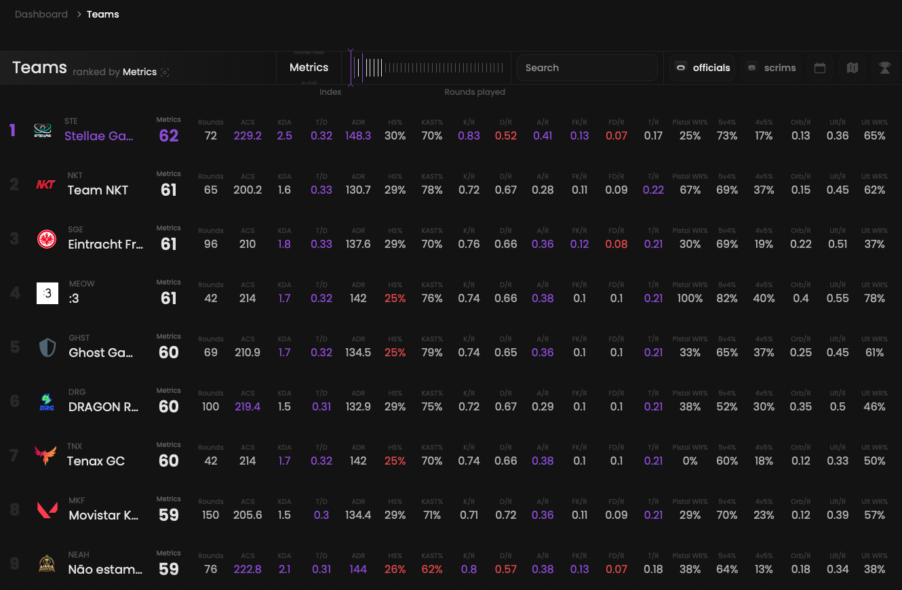

## Prerequisites

- An active account ([learn more](/get-started/setup))

## Steps

Start by going to the teams page at [qiton.app/teams](https://qiton.app/teams).
You will find all teams detected by our system.

## Preview

<Frame>
    
    
</Frame>

## Available filters

- `Team name`
