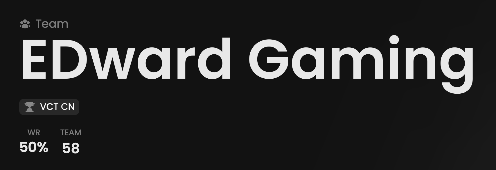

<Frame>
    <video
        autoPlay
        playsInline
        className="w-full aspect-video"
        src="./images/summary/presentation.mp4"
    ></video>
</Frame>

_The voice has been generated using AI._
Welcome to our new Team feature page! Enjoy this short video.

About our summary component, it displays the team name and the most played tournament.

## Prerequisites

- An active account ([learn more](/get-started/setup))
- You have to select a team beforehand ([learn more](/core/team/root))

## Preview

<Frame>
    
</Frame>

## Available statistics

- `WR`
- `Metrics`

Descriptions are available [here](/core/statistics-meaning).

## Metrics

Each Metrics score displayed on this page is calculated through the following steps.

1. For each player linked to **the selected team**, we calculate a Metrics score by considering **his primary role’s
preset** and **his statistics**.
2. We then calculate the final score by taking an **average** of all these scores.

Learn more [here](/core/metrics).
