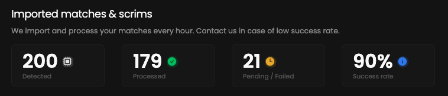

<Info>When we say "matches", we mean both officials and scrims.</Info>

## Prerequisites

- An active account ([learn more](/get-started/setup))

## Success rate

Our system is designed to import your last 100 matches from GRID.GG hourly. Sometimes errors can occur due to various reasons.
That's why we have a settings section to show you how many matches were successfully imported.

Please go to the settings page [here](https://qiton.app/settings). You will see some statistics like:

<Frame>
    
    
</Frame>

## Why my success rate is low?

Usually it means that our system is currently processing your matches. Please wait a few hours and refresh the page.
If the success rate is still low, please [contact us](/miscellaneous/support).
