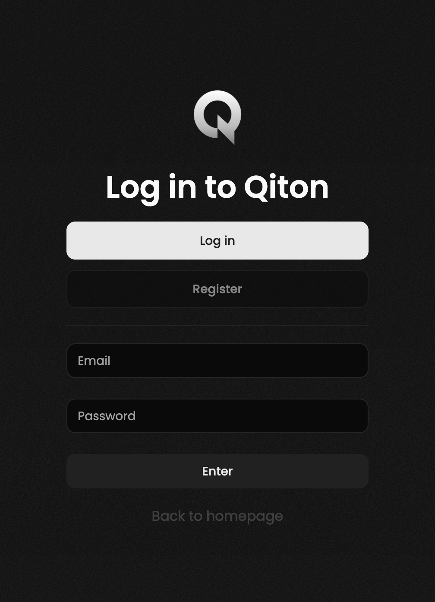
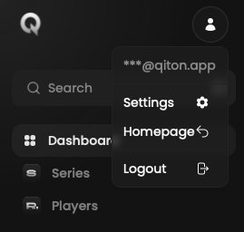
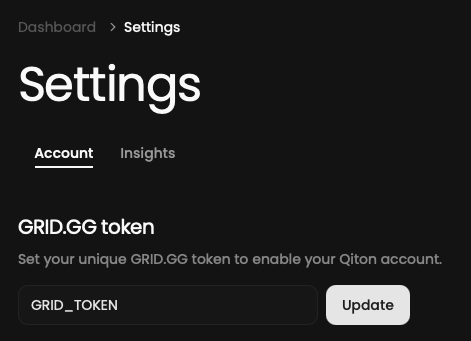

## Prerequisites

- An account ([disclaimer](/troubleshooting/register))
- A token provided by GRID.GG

## Steps

Start by logging in to your account at [qiton.app/login](https://qiton.app/login).

<Frame>
    
</Frame>

Then go to the settings page.

<Frame>
    
</Frame>

You should be able to see the token field.
Paste your secret and save.

<Frame>
    
</Frame>

Congratulations!

You are now ready to use Qiton 🥳.
You will see your scrims and officials following the next hour.
In case of failure please check your token validity and try again.

## Tips

<Steps>
    <Step title="Limited scrims support">
        We are currently only able to import scrims played on the **Tournaments server**.
        If you want to analyze your private matches with Qiton, please use it.
    </Step>
    <Step title="Assistance">
        Qiton is a new platform, so feel free to share your feedback with us [here](/miscellaneous/support).
    </Step>
</Steps>
