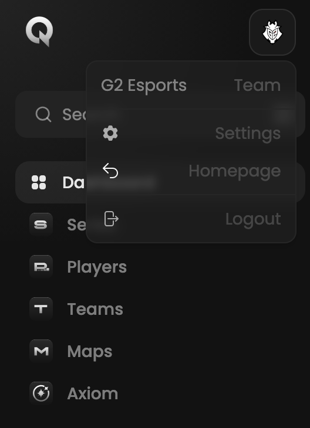

## Prerequisites

- An account
- A token provided by GRID.GG

## Steps

Start by logging in to your account at [qiton.app/login](https://qiton.app/login).
<Frame>
    
    
</Frame>

Then go to the settings page.
<Frame>
    
    
</Frame>

You should be able to see the token field. Paste your secret and save.
<Frame>
    
    
</Frame>

Congratulations! You are now ready to use Qiton 🥳. You will see your scrims and officials following the next hour.
In case of failure please check your token validity and try again.
