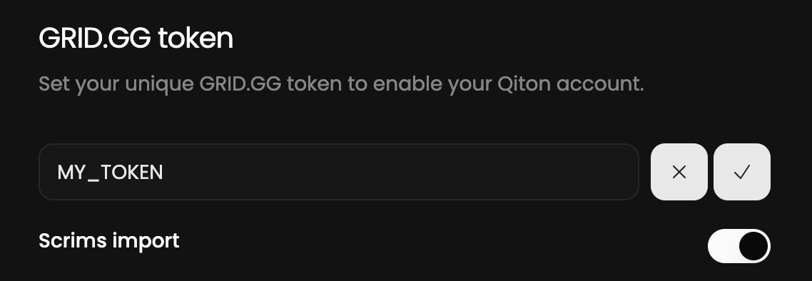

Our services operate by retrieving raw data from our provider, GRID.GG.
This page provides a detailed step-by-step guide to help you link your Qiton account to the GRID.GG account.

## Prerequisites

- An account ([disclaimer](/troubleshooting/register))
- A token provided by GRID.GG

## Steps

Start by logging in to your account at [qiton.app/login](https://qiton.app/login).

<Frame>
    
</Frame>

Then go to the settings page.

<Frame>
    
</Frame>

You should be able to see the token field.
Paste your secret and save.

Please note that the Scrims import is enabled by default, you can disable it if you want.

<Frame>
    
</Frame>

Congratulations!

You are now ready to use Qiton 🥳.
You will see your Scrims and Officials following the next 30 minutes.
In case of failure please check your token validity and try again.

## Tips

<Steps>
    <Step title="Limited Scrims support">
        We are currently only able to import Scrims played on the **Tournaments server**.
        If you want to analyze your private matches with Qiton, please use it.
    </Step>
    <Step title="Assistance">
        Qiton is a new platform, so feel free to share your feedback with us [here](/miscellaneous/support).
    </Step>
</Steps>
