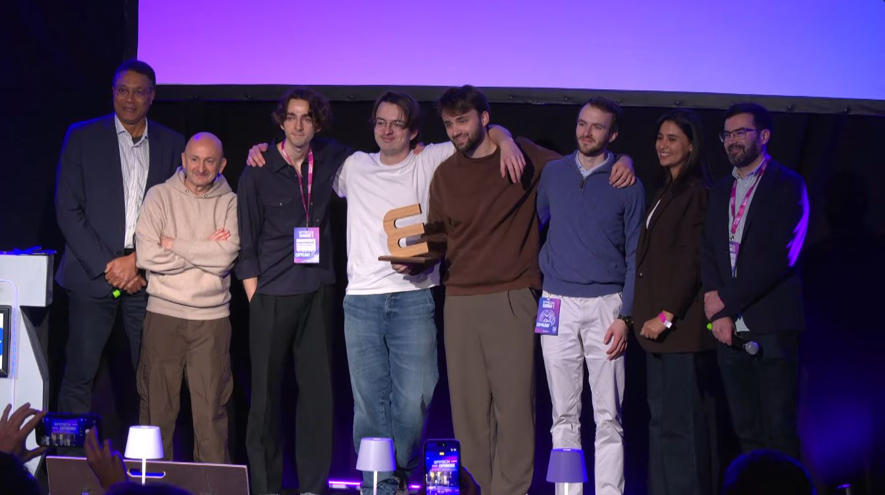
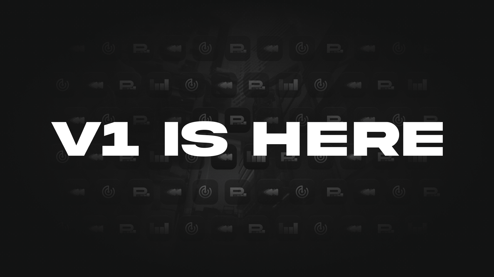
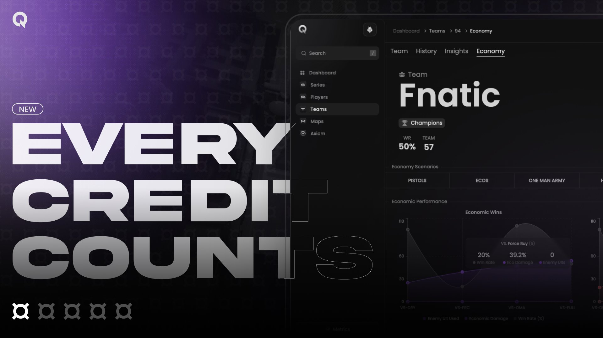
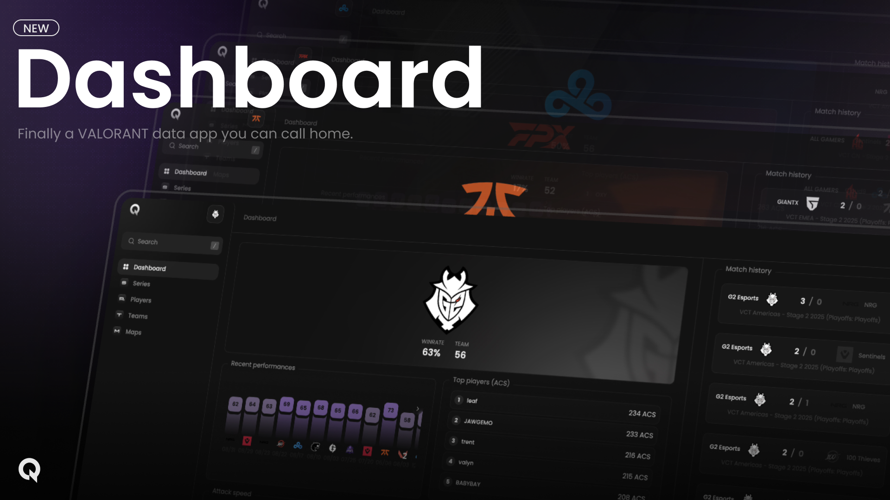
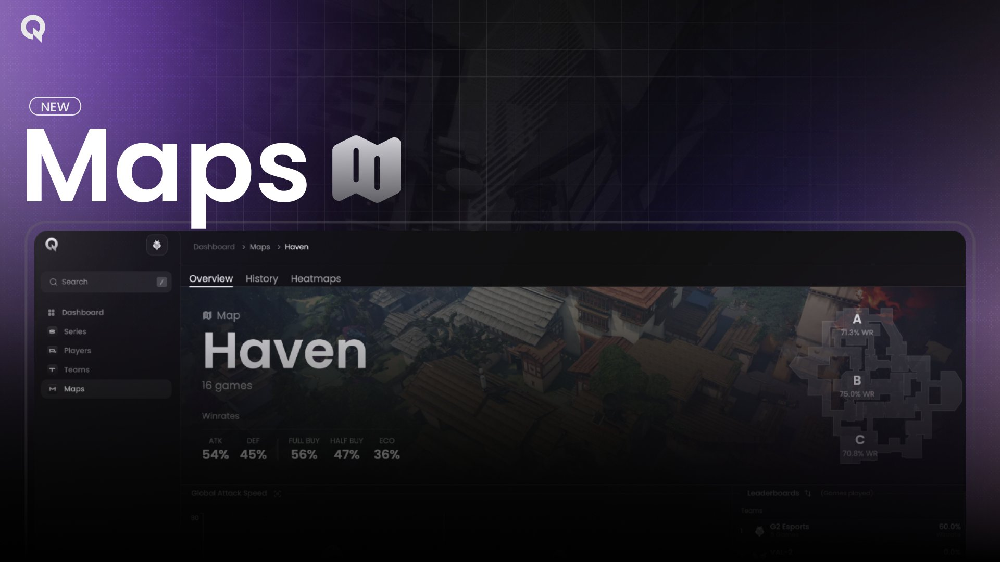
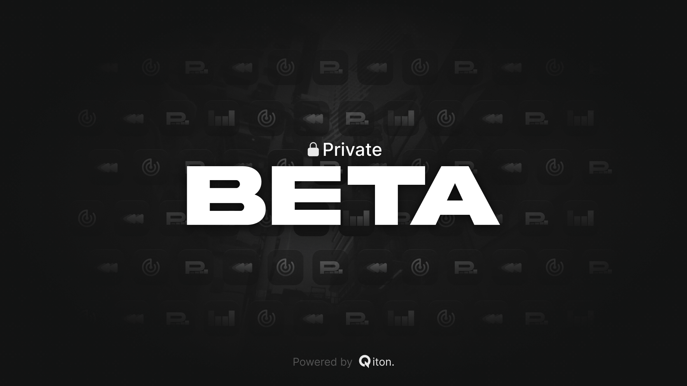
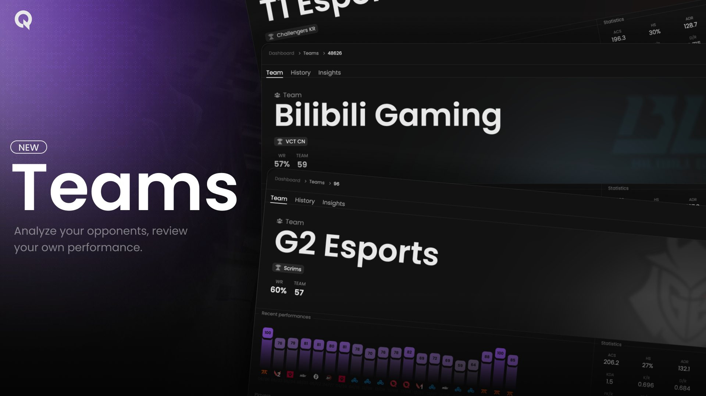
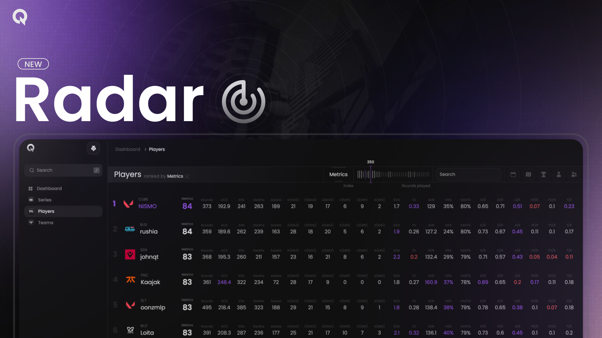

<Update label="v2.0.0" description="February 02, 2026">
    <Frame>
        
    </Frame>
    We are very proud to announce that Qiton has won the 2026 Epitech Experience.
    This is proof of what we have achieved over the past two years.
    The €5,000 award will be invested into the Qiton company.
    Thank you for following our journey, it means a lot to us.
</Update>

<Update label="v1.1.0" description="December 19, 2025">
    <Frame>
        
    </Frame>
    Qiton is officially deemed stable and ready for use.
    Thank you for following our journey!
</Update>

<Update label="v0.32.0" description="November 26, 2025">
    Axiom is finally here.
    Our most advanced feature.
    Designed for pros.
    Learn more [here](/core/axiom).
</Update>

<Update label="v0.28.3" description="November 1, 2025">
    Very advanced filters have been added to the [Minimap](/core/map/heatmaps/minimap).
</Update>

<Update label="v0.28.2" description="October 29, 2025">
    The Team economy feature is now fully operational and deployed.
    Thank you for using Qiton.
</Update>

<Update label="v0.28.1" description="October 28, 2025">
    <Frame>
        <video
            autoPlay
            muted
            loop
            playsInline
            src="./images/releases/features.mp4"
        ></video>
    </Frame>
    New landing page about the core Qiton features.
    Available at [qiton.app/features](https://qiton.app/features).
</Update>

<Update label="v0.25.1" description="October 10, 2025">
    <Frame>
        
    </Frame>
    During #VALORANTChampions we had the opportunity to work with some of the best teams in the world and see them push
    Qiton to its limits.
    That's why we are making a huge update to teams statistics related to economy.
    Learn more [here](/core/team/economy/economic-performance).
</Update>

<Update label="v0.24.0" description="October 6, 2025">
    New [economy chart](/core/match/economy) available for sub-matches.
</Update>

<Update label="v0.20.1" description="September 20, 2025">
    You can now [download](/miscellaneous/assets) our assets.
</Update>

<Update label="v0.20.0" description="September 19, 2025">
    New documentation page explaining how pricing works.
    Learn more [here](/miscellaneous/pricing).
</Update>

<Update label="v0.18.0" description="September 8, 2025">
    <Frame>
        
    </Frame>
    A new Dashboard page has been created, featuring personalized content about your team.
    Learn more [here](/core/dashboard).
</Update>

<Update label="v0.16.0" description="September 1, 2025">
    New `Pistol WR%`, `5v4%`, `4v5%`, `Orb/R`, `Ult/R` and `Ult WR%` statistics available on the Teams page
    [qiton.app/teams](https://qiton.app/teams).
</Update>

<Update label="v0.15.0" description="July 31, 2025">
    All Map features have been developed and are available for customers.
</Update>

<Update label="v0.13.1" description="July 20, 2025">
    <Frame>
        
    </Frame>
    We are continuing our work on the Map core feature.
    New components have been released, check them out [here](/core/map/root).
</Update>

<Update label="PRIVATE BETA" description="June 17, 2025">
    <Frame>
        
    </Frame>
    Today is a **big day** for **Qiton**.
    We are letting in a very very limited amount of teams in on our development process to build the future of Valorant
    data.
    Want to join our private beta ? [Register to the waiting list here](https:///qiton.app) and we'll reach out to you.
</Update>

<Update label="v0.12.0" description="June 10, 2025">
    <Frame>
        
    </Frame>
    Our [video](/core/team/summary) demonstrates how the new **Team** feature allows you to analyze a team globally.
</Update>

<Update label="v0.10.4" description="May 27, 2025">
    The [teams list](/core/team/root) page has been reworked.
    You can now, like the players list, compare any teams.
</Update>

<Update label="v0.10.0" description="May 22, 2025">
    <Frame>
        
    </Frame>
    We'll start a **very private beta** soon.
    If you want to be one of the first teams in the world to try out Qiton, send your email [here](https://qiton.app)
    and we'll get back to you if we believe you are a good candidate.
</Update>

<Update label="v0.9.0" description="May 13, 2025">
    <Frame>
        
    </Frame>
    The **Radar** feature is now available, enabling you [to compare](/core/player/root) players based on their
    statistics.
</Update>

<Update label="v0.5.5" description="March 4, 2025">
    <Frame>
        
    </Frame>
    We're very proud to announce that we delivered our first version to G2 Esports. Thank you for your trust.
</Update>
