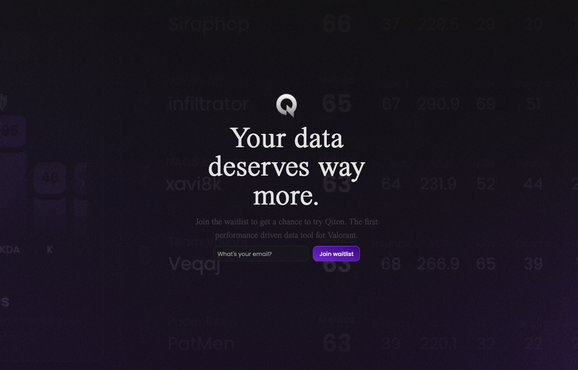
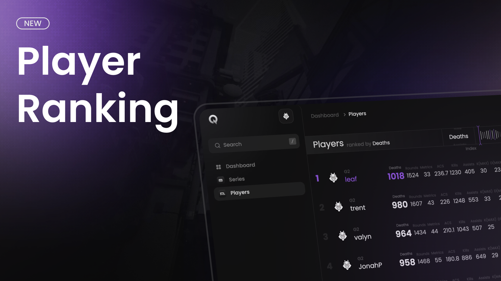
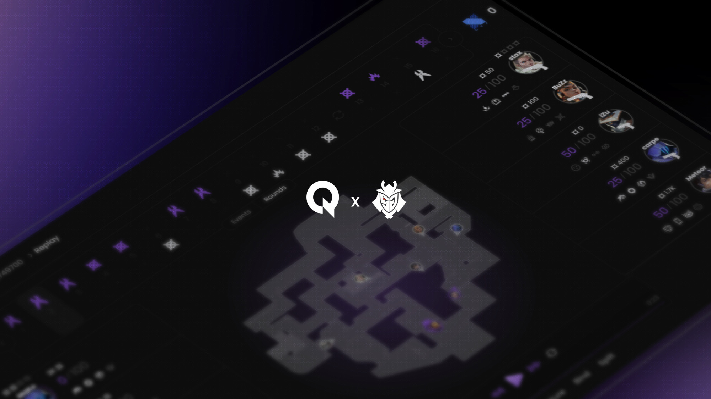

<Update label="v1.0.0" description="coming late 2025">
    We’re cooking. As Qiton is still in the development phase, we don’t detail minor patches.
</Update>

<Update label="v0.10.0" description="22 may 2025">
    <Frame>
        
        
    </Frame>
    We'll start a **very private beta** soon.
    If you want to be one of the first teams in the world to try out Qiton, send your email [here](https://qiton.app)
    and we'll get back to you if we believe you are a good candidate.
</Update>

<Update label="v0.9.0" description="13 may 2025">
    <Frame>
        
        
    </Frame>
    The **Player Ranking** feature is now available, enabling you [to compare](/core/player/root) players based on their
    statistics.
</Update>

<Update label="v0.5.5" description="4 march 2025">
    <Frame>
        
        
    </Frame>
    We’re very proud to announce that we delivered our first version to G2 Esports. Thank you for your trust.
</Update>
