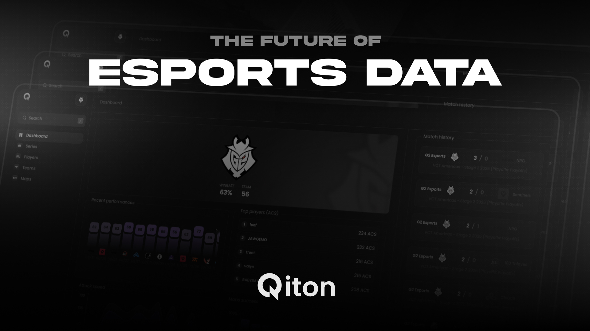
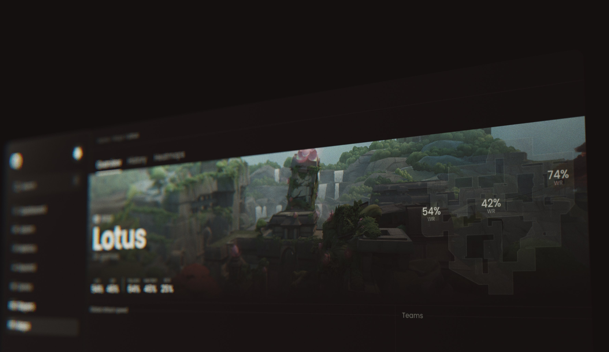

<Info>
    The private beta is now open and eagerly awaiting the participation of more teams.
    Please [contact us](/miscellaneous/releases#private-beta) now to apply!
</Info>

---

<Frame>
    
</Frame>

Hello and welcome to the Qiton documentation.
Here you'll find more information about our project as we strive to build things as transparently as possible.

## Why we started Qiton ?

<Frame>
    
</Frame>

Esports teams get access to hard-to-understand data under the format of JSONL (20,000+ lines each).
This ecosystem is still young and teams often don't have the budget to hire experienced developers.
Our goal is to make this data more accessible and easier to understand for coaches and analysts.

## Endorsed by G2 Esports

<Frame>
    
</Frame>

We would like to take a moment to thank G2 Esports.
They're helping us by sending feedback in order to make Qiton better.

## Supported games

We are focusing our work on Valorant at the moment.

## Latest release

Qiton **v0.13.1** has been released recently. Check it out [here](/miscellaneous/releases#v0-13-1).
