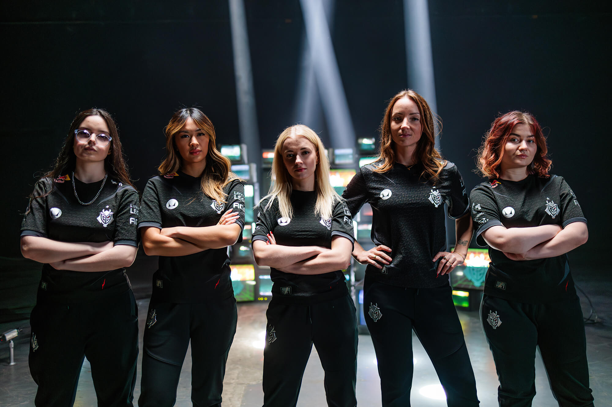

<Frame>
    
    
</Frame>

## Why we started Qiton ?

Esports teams get access to hard-to-understand data under the format of JSONL (20,000+ lines each).
This ecosystem is still young and teams often don't have the budget to hire experienced developers.
Our goal is to make this data more accessible and easier to understand for coaches and analysts.

## Endorsed by G2 Esports

We would like to take a moment to thank G2 Esports.
They’re helping us by sending feedbacks in order to make Qiton better.

<Frame>
    
    
</Frame>

## Supported games

We are focusing our work on Valorant at the moment.
