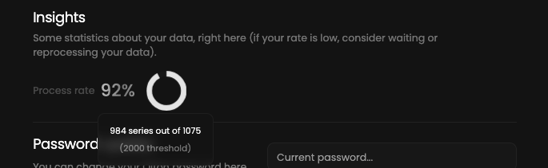

As Qiton is still in development, we are aware of some issues and limitations that we have.

## Last 100 matches
~When a new account is delivered, we import the last 100 matches from GRID.GG.
So if your team played more than 100 matches during onboarding, only the last 100 matches will be imported.~

We have resolved this issue. We can now import as many matches as we desire.

## Total matches limit

Stored matches take a lot of space. We are currently working on a limit per account which could be increased by contacting us.
By default, the limit is set to 200 matches per type per account (for example, 200 means 200 officials and 200 scrims at the same time).
Obviously the oldest matches will be deleted first.

You can go to the settings page [here](https://qiton.app/settings) to be aware of your current plan:

<Frame>
    
    
</Frame>
