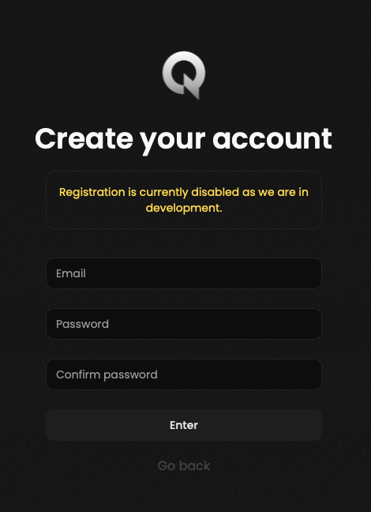

<Frame>
    
</Frame>

During the registration process you may encounter the following error:
> Account already exists

As we are currently in development we have disabled the sign-up form intentionally.

Feel free to [contact us](/miscellaneous/pricing#getting-started) if you would like to be part of the beta testing phase,
and we will get back to you as soon as possible.
Don't forget that you need a GRID.GG active account to use Qiton.
