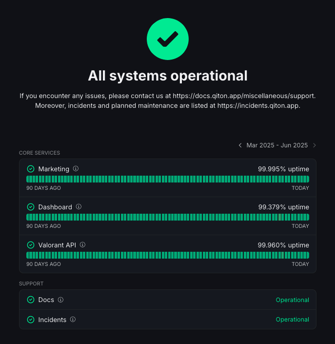
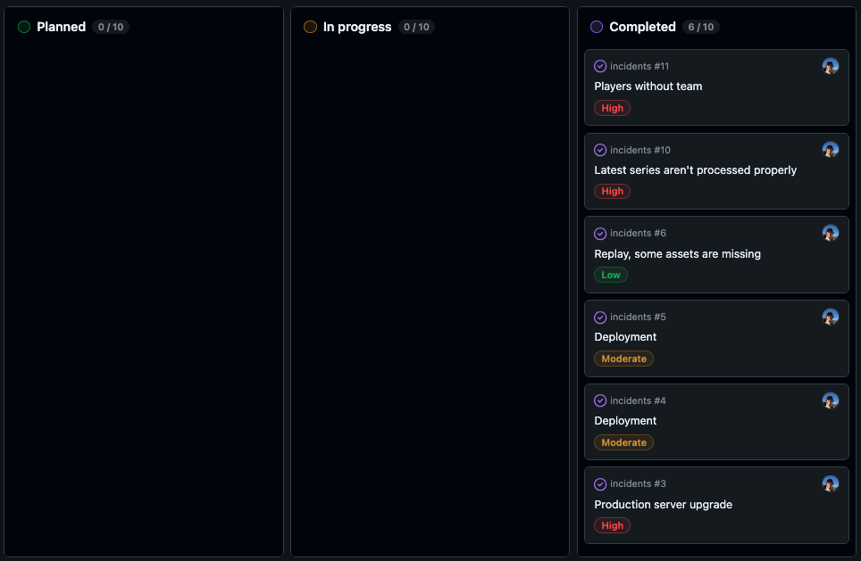

<Info>
    You could experience some latencies everyday at 3:00AM (UTC+0) due to the daily backup process.
    Should not take more than 5 minutes.
</Info>

## Monitoring

We use automated tools to monitor the status of our services.
You can check it at any time by visiting [status.qiton.app](https://status.qiton.app).

<Frame>
    
</Frame>

### Marketing

All static content like videos, images, CSS, JS and HTML resources.
These resources should never be down as we are using load balancers.

So by loading [qiton.app](https://qiton.app), you are accessing the **Marketing** part.

### Dashboard

Very similar to the **Marketing** part, except that it applies to all dynamic content.

So by using Qiton as a customer, you are loading dynamic content to get your data.

### Valorant API

All images linked to the Valorant game (maps, agents, items).

### Docs

The page you are reading.

### Incidents

Sometimes we schedule maintenances to upgrade our infrastructure.
Additionally unplanned problems may occur and don’t directly affect the entire website such as Valorant significant
changes.

We recommend that you regularly check [incidents.qiton.app](https://incidents.qiton.app) to monitor any current or
future incidents.

<Frame>
    
</Frame>

## Report an issue

You can do it [here](/miscellaneous/support).

Thank you for helping us.
